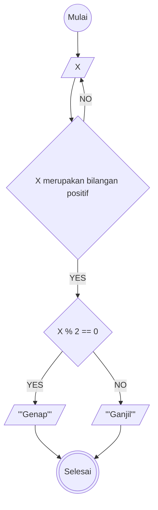

# Minitask Algoritma

Membuat algoritma menentukan bilangan ganjil atau genap

Langkah-langkah:
1. Mulai
2. Memasukkan nilai yang akan dicek merupakan bilangan ganjil atau genap
3. Mengecek nilai yang dimasukkan berupa bilangan positif
4. Jika nilai yang dimasukkan benar merupakan bilangan positif, maka lanjut ke langkah berikutnya, jika tidak maka kembali ke langkah ke-2
5. Jika bilangan yang dimasukkan dapat habis dibagi 2, maka bilangan tersebut merupakan bilangan genap
6. Jika bilangan yang dimasukkan tidak habis dibagi 2, maka bilangan tersebut merupakan bilangan ganjil
7. Mencetak hasil bilangan yang dimasukkan merupakan bilangan genap atau ganjil
8. Selesai

# Flowchart

