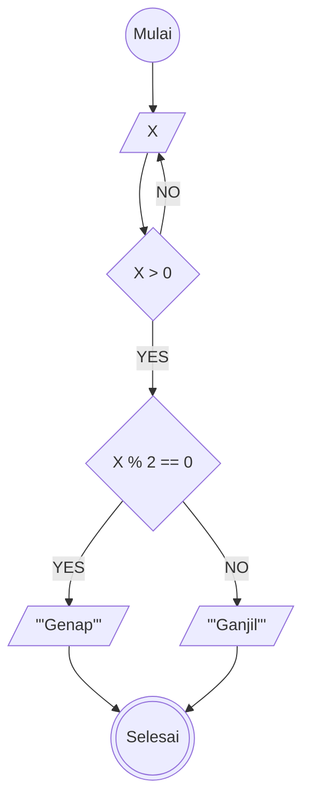

# Minitask Algoritma

Membuat algoritma menentukan bilangan ganjil atau genap

Langkah-langkah:
1. Mulai
2. Memasukkan X
4. Jika X lebih besar dari 0, maka lanjutkan ke langkah berikutnya, jika tidak maka kembali ke langkah kedua
5. Jika X dapat habis dibagi 2, maka outputkan "genap"
6. Jika X tidak habis dibagi 2, maka outputkan "ganjil"
8. Selesai

# Flowchart



# Pseudo-Code
```
// Program Ganjil Genap

DECLARE X: INTEGER

INPUT X

IF X>0 THEN
    IF X MOD 2 = 0 THEN
        OUTPUT "GENAP"
    ELSE
        OUTPUT "GANJIL"
    ENDIF
ENDIF    

```