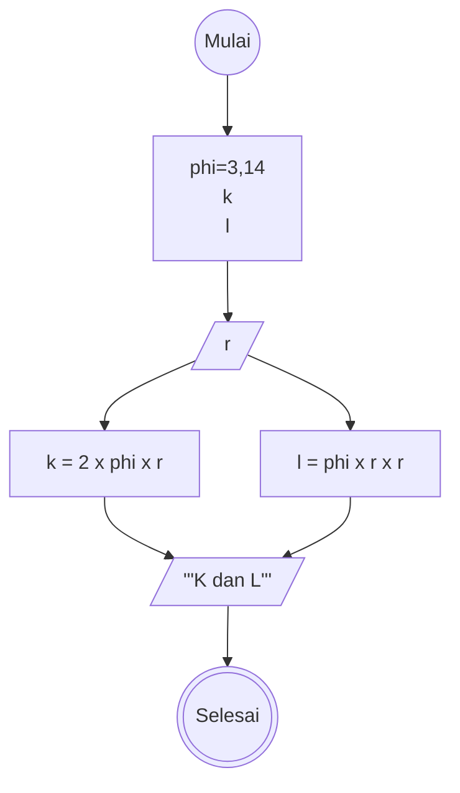

# Algoritma Menghitung Luas & Keliling Lingkaran

Langkah-langkah:
1. Mulai
2. Deklarasikan phi dengan nilai 3,14 dan deklarasikan variabel lainnya seperti r sebagai jari-jari, k sebagai keliling dan l sebagai luas
3. Input r
4. Hitung k dengan rumus 2 dikalikan phi dikalikan r (k = 2 x phi x r)
5. Hitung l dengan rumus phi dikalikan r dikalikan r (l = phi x r x r)
6. Output hasil hitung k dan l
7. Selesai

# Flowchart

