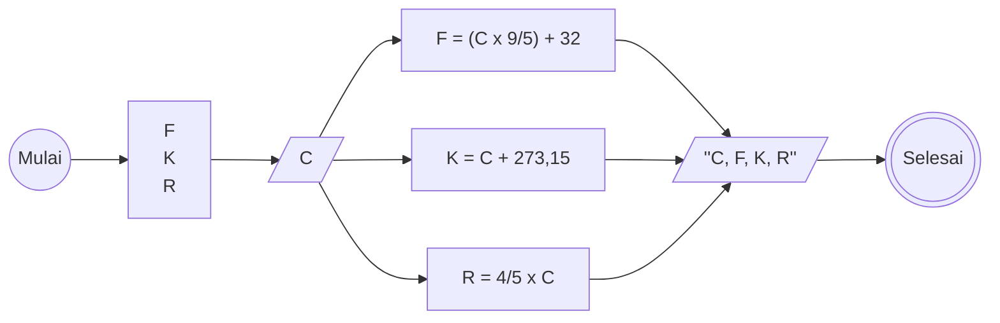

# Algoritma Konversi Suhu

Langkah-langkah:
1. Mulai
2. Deklarasikan variabel C, F, K, R
2. Input C yaitu suhu dalam celcius
3. Konversikan C (suhu dalam celcius) ke F (suhu dalam fahrenheit) dengan rumus F = (C x 9/5) + 32 
4. Konversikan C (suhu dalam celcius) ke K (suhu dalam kelvin) dengan rumus K = C + 273,15
5. Konversikan C (suhu dalam celcius) ke F (suhu dalam Reamur) dengan rumus R = C x 4/5
6. Outputkan C, F, K, R
7. Selesai

## Flowchart



# Pseudocode
```
DECLARE C : REAL
DECLARE F : REAL
DECLARE K : REAL
DECLARE R : REAL

INPUT C

F <- (9/5 * C) + 32
K <- C + 273
R <- 4/5 * C

OUTPUT "Hasil Konversi Celcius ke Fahrenheit", F
OUTPUT "Hasil Konversi Celcius ke Kelvin", K
OUTPUT "Hasil Konversi Celcius ke Reamur", R

```